# EPEX day-ahead price prediction

This is a simple statistical model to predict EPEX day-ahead prices based on various parameters.
It works to a reasonably good degree. Better than many of the commercial solutions.
This repository includes
- The self-training prediction model itself
- A simple FastAPI app to get a REST API up
- A Docker compose file to have it running wherever

Supported Countries:
- Germany (default)
- Austria
- Belgium
- Netherlands
- Others can be added relatively easily, if there is interest


## Lookout
- Maybe package it directly as a Home Assistant Add-on

## The Model
We sample multiple locations distributed across each country, including offshore North Sea locations for coastal countries (DE, NL, BE) to capture offshore wind farm production. We fetch hourly [Weather data from Open-Meteo.com](https://open-meteo.com/) for those locations for the past n days (default n=90).
This serves as the main data source.
Price data is provided under CC BY 4.0 by smartd.de, retrieved via https://api.energy-charts.info/.


Parameters:

- Wind for each location
- Temperature for each location
- Expected solar irradiance for each location
- Hour of day
- Day of the week from monday to saturday
- Whether it is a Holiday/Sunday (regional holidays are considered by the number of regions they apply to, e.g. 0.5 if a holiday applies to half the regions of a country)
- A measure of sunrise influence - how many minutes between sunrise and now, capped at 3 hours: $\min(180, |t_{now} - t_{sunrise}|)$ and vice versa for
- A measure of sunset influence, same formula

Output:
- Electricity price

## How it works
- First, we use Lasso regression (L1 regularization) to determine the importance of each training parameter.
Lasso helps by zeroing out less important features, improving model accuracy with many input variables.
- This alone is not enough, because electricity prices are not linear.
E.g. low wind&solar leads to gas power plants being turned on, and due to merit order pricing, electricity prices explode.
- Therefore, we then multiply each parameter with its weight (Lasso coefficients) to get a "normalized" data set.
- In the next step, we use a KNN (k=7) approach to find hours in the past with similar properties and use that to determine the final price.

## Model performance
For performance testing, we used historical weather data with a 90%/10% split for a training/testing data set. See `predictor/model/performance_testing.py`.

Results:\
DE: Mean squared error ~1.3 ct/kWh, mean absolute error ~0.6 ct/kWh\
AT: Mean squared error ~1.9 ct/kWh, mean absolute error ~0.8 ct/kWh\
BE: Mean squared error ~1.7 ct/kWh, mean absolute error ~0.8 ct/kWh\
NL: Mean squared error ~1.9 ct/kWh, mean absolute error ~0.8 ct/kWh

Some observations:
- At night, predictions are typically within 0.5ct/kWh
- Morning/Evening peaks are typically within 1-1.5ct/kWh
- Extreme peaks due to "Dunkelflaute" are correctly detected, but estimation of the exact price is a challenge. E.g.
the model might predict 75ct, while in reality it's only 60ct or vice versa
- High PV noons are usually correctly detected with good accuracy.
- Offshore wind data significantly improves prediction accuracy for coastal countries (BE, NL, DE)

This graph compares the actual prices to the ones returned by the model for a random two week time period in early 2025.

Note that this was created for a time range in the past with historic weather data, rather than forecasted weather data,
so actual performance might be a bit worse if the weather forecast is not correct.

```mermaid
---
config:
    xyChart:
        width: 1700
        height: 900
        plotReservedSpacePercent: 80
        xAxis:
            showLabel: false
---
xychart-beta
    title "Performance comparison"
    line [10.8,10.5,10.7,10.0,10.7,10.7,9.9,9.8,10.5,10.1,9.6,9.2,10.0,9.8,9.6,9.1,9.7,8.9,9.0,8.4,9.0,8.6,8.1,8.1,8.7,8.3,8.2,8.1,8.7,8.5,8.3,8.5,8.7,8.6,8.8,9.0,8.7,8.7,8.8,9.2,8.7,8.6,8.9,9.8,9.2,9.4,9.5,10.2,9.9,10.2,10.5,11.0,10.9,11.0,11.6,11.8,11.5,11.7,11.4,11.3,11.4,11.5,11.2,10.9,11.3,11.0,11.1,11.0,10.9,10.8,11.2,11.3,10.9,11.2,11.8,12.1,11.6,12.2,12.0,12.0,11.7,11.8,12.1,12.7,11.4,12.0,12.0,12.6,12.7,12.2,12.0,12.0,12.9,12.1,11.4,11.0,11.3,10.4,10.3,9.5,10.4,9.7,9.5,9.0,9.5,9.2,9.4,9.1,10.2,9.1,8.6,9.1,10.4,9.1,8.4,8.3,10.4,9.8,9.3,8.8,9.9,9.0,8.6,8.5,9.1,8.7,8.6,8.3,8.6,8.6,8.6,8.4,8.6,8.4,8.7,8.6,8.7,8.6,8.7,8.7,8.4,8.7,8.8,9.4,8.8,9.1,9.3,10.0,9.9,10.2,10.3,10.4,10.7,11.0,10.7,10.4,11.2,10.6,9.9,9.4,10.5,10.4,9.9,9.8,10.2,9.8,9.7,9.6,9.9,9.7,9.3,9.0,9.4,9.6,10.1,10.4,9.4,10.3,10.3,10.4,9.2,10.0,9.9,10.0,10.2,10.0,9.6,9.1,10.1,9.1,8.6,8.6,8.8,8.7,8.5,8.4,8.5,8.2,8.1,7.9,8.4,7.8,8.0,7.4,8.3,7.9,7.6,7.2,7.8,7.2,6.9,6.4,7.2,7.0,6.9,6.9,7.1,6.8,6.9,6.7,6.9,6.7,6.7,6.7,6.6,6.6,6.6,6.7,7.1,7.0,7.2,7.3,7.0,7.3,7.7,7.6,7.1,7.5,7.9,8.7,8.1,8.1,9.6,10.4,8.9,9.1,10.1,9.3,9.4,9.1,9.0,8.9,10.2,9.1,8.7,7.8,8.6,8.2,8.5,8.6,8.8,8.4,8.7,8.7,9.0,8.8,8.7,8.9,9.1,9.2,9.2,9.4,9.2,10.3,10.1,10.3,9.5,10.1,10.3,10.5,10.7,10.9,10.9,10.6,10.4,10.2,9.9,9.8,9.5,9.5,9.3,9.2,9.2,9.1,8.8,8.6,9.2,8.5,8.3,8.0,9.2,8.8,8.3,7.7,8.9,8.0,7.4,6.9,8.0,7.3,7.1,6.4,6.7,6.5,6.5,6.4,6.4,6.2,6.1,6.1,6.0,6.0,6.0,5.8,5.8,5.8,5.8,5.8,5.8,5.8,5.9,6.0,6.4,6.4,7.1,7.3,7.2,7.6,8.0,8.4,7.9,8.4,8.4,8.8,8.5,8.6,8.7,8.4,8.5,8.6,8.4,8.0,8.6,8.2,8.1,7.8,8.3,8.0,8.0,7.9,8.1,7.9,7.8,7.9,7.7,7.8,8.1,8.1,7.6,8.1,8.4,8.6,8.2,8.0,8.5,8.9,8.0,8.1,8.4,8.5,8.4,8.2,8.5,8.4,8.3,8.3,8.2,8.2,8.7,8.3,7.4,6.8,7.7,7.4,6.8,6.1,7.7,7.1,7.2,6.7,7.2,6.4,6.4,5.7,6.6,6.6,5.7,5.2,5.8,5.6,5.4,5.5,5.6,5.7,5.7,5.7,5.7,5.6,5.6,5.4,5.6,5.6,5.6,5.6,5.6,5.3,5.6,5.7,5.4,5.4,6.0,6.0,5.9,6.7,6.7,7.6,7.5,7.5,8.6,8.9,8.9,8.5,8.1,7.5,8.0,7.6,7.5,7.3,7.1,7.0,6.8,6.7,7.0,6.9,6.8,6.7,6.7,6.7,6.8,6.9,6.9,7.1,7.4,8.1,7.3,8.8,8.7,8.5,8.3,8.9,9.1,8.9,9.0,8.9,9.0,8.8,8.9,7.6,7.7,7.3,7.4,7.2,7.2,6.9,7.1,6.9,6.8,6.4,7.1,6.7,6.8,6.6,7.2,6.9,6.9,6.6,7.0,7.1,6.5,5.5,6.6,6.1,6.1,6.4,6.0,5.9,5.7,5.7,5.8,5.7,5.7,5.6,5.7,5.6,5.6,5.5,5.5,5.4,5.5,5.5,5.4,5.4,5.1,5.2,4.7,5.1,5.1,4.7,4.7,5.1,5.8,6.0,6.4,6.4,6.7,6.1,6.8,6.5,6.4,6.2,5.8,5.4,4.9,5.4,5.0,4.6,4.9,5.1,5.5,5.0,4.5,4.4,4.2,4.3,4.7,6.0,5.2,6.6,7.2,8.4,7.5,8.4,9.8,10.1,9.0,8.5,9.7,9.7,8.8,9.4,9.7,9.7,9.5,9.5,9.4,9.2,9.2,9.2,9.1,9.2,9.6,9.6,8.8,8.5,9.0,9.6,9.5,9.0,9.8,9.7,9.7,9.3,9.6,9.1,9.1,8.8,10.6,10.0,9.1,9.1,9.6,9.1,9.1,8.6,9.1,8.6,8.5,8.2,8.5,8.3,8.2,8.2,8.0,8.2,8.3,8.4,8.1,8.1,8.3,8.6,8.0,8.1,8.8,9.0,8.7,9.1,9.4,10.1,9.5,9.7,10.2,10.2,10.4,10.3,9.5,8.5,9.6,9.1,8.7,8.3,8.9,8.5,8.4,8.2,8.3,8.2,8.2,8.2,8.0,8.1,8.6,8.6,7.5,8.6,9.4,11.6,9.1,10.8,11.6,12.2,11.1,11.7,11.8,12.1,11.9,12.1,12.2,12.0,11.9,11.7,11.8,11.4,11.8,11.6,11.7,11.5,12.2,11.7,11.1,10.6,11.8,11.5,10.9,10.3,11.7,11.4,10.5,9.6,11.1,10.4,9.4,8.8,10.4,9.9,9.4,9.0,10.2,9.1,8.9,8.5,8.9,8.6,8.4,8.1,8.5,8.3,8.2,8.0,8.4,8.4,8.4,8.4,7.9,8.2,8.3,8.9,7.8,8.5,9.1,9.8,9.3,9.7,10.3,10.5,10.5,10.5,10.4,9.5,10.9,10.4,8.8,7.5,10.2,7.8,7.1,6.9,7.8,7.7,7.5,7.1,7.8,7.1,7.4,7.5,7.1,7.4,7.8,8.5,6.9,7.9,8.2,9.4,7.6,8.9,10.0,11.3,9.2,9.9,10.8,11.3,9.6,10.9,11.0,10.9,10.9,10.9,10.8,10.8,10.9,10.5,10.1,10.5,11.5,10.5,9.9,9.1,10.3,9.6,9.2,8.5,10.5,10.0,9.0,8.6,10.3,9.5,8.8,7.9,9.1,8.8,8.3,7.5,9.1,8.6,8.2,7.5,8.6,8.0,7.7,7.7,7.7,7.6,8.0,8.2,7.8,7.9,8.3,8.2,8.0,8.1,8.5,8.9,7.9,8.5,8.8,9.4,8.2,9.0,9.5,10.2,9.3,9.8,10.0,9.9,10.4,10.0,9.8,8.5,10.0,9.0,8.3,8.0,9.5,9.1,8.7,8.1,8.3,7.9,8.0,7.9,7.7,7.8,8.1,8.5,8.0,8.2,8.7,9.7,8.7,9.6,11.1,10.9,10.3,11.1,11.4,11.6,11.2,11.5,11.4,11.4,12.1,11.6,11.4,10.8,11.4,11.0,10.8,10.6,10.8,10.7,10.4,10.1,10.1,10.0,9.9,9.6,10.0,9.9,9.8,9.6,9.8,9.3,8.6,7.7,10.1,9.5,8.5,7.9,9.0,7.9,8.5,8.6,9.0,8.5,8.1,8.0,8.4,8.2,8.1,8.1,8.1,8.1,8.5,8.8,8.5,8.9,9.2,9.8,8.8,9.5,9.7,10.5,9.7,10.6,10.7,11.0,11.9,11.4,11.2,11.0,12.0,11.2,10.9,10.2,10.7,10.4,9.5,8.4,9.4,8.8,9.1,8.8,8.7,8.7,8.8,8.9,8.7,8.8,8.8,9.1,9.0,9.4,9.7,10.2,9.5,10.4,10.9,10.6,10.6,10.9,11.2,10.7,10.7,10.7,10.8,10.6,10.6,10.6,10.1,10.0,10.5,9.6,9.0,9.0,9.7,9.2,8.8,8.4,8.5,8.4,8.5,8.0,9.0,8.7,8.9,8.6,9.0,8.5,8.4,7.4,8.7,8.2,7.3,7.0,7.7,7.3,7.2,7.1,7.4,7.3,7.0,7.0,7.1,6.9,6.9,6.8,6.8,6.8,6.9,6.9,6.9,7.2,7.0,7.7,6.9,7.8,8.6,8.7,8.0,8.7,9.3,9.2,9.3,9.9,9.5,9.2,10.5,10.0,9.4,8.0,9.7,8.6,8.1,7.9,8.1,8.0,7.9,7.7,7.9,7.7,7.6,7.3,7.3,7.5,7.5,8.5,7.2,8.6,9.4,10.4,9.0,9.7,11.1,11.2,10.1,10.8,10.8,12.0,10.9,11.4,11.0,11.0,11.5,10.9,10.6,10.6,10.7,10.6,10.5,10.5,10.5,10.3,10.1,9.5,10.2,9.5,9.0,8.6,10.1,9.4,8.9,8.3,9.5,8.8,8.2,7.8,9.5,9.0,8.6,8.1,9.0,8.3,8.3,8.1,8.4,8.1,7.9,7.7,8.0,7.6,7.5,7.5,7.4,7.5,7.5,7.6,7.5,7.6,7.8,8.1,7.8,8.2,8.3,8.4,8.0,8.2,8.7,9.2,9.1,9.8,9.7,9.7,10.3,10.0,9.4,8.5,9.7,9.0,8.7,8.3,8.8,8.4,8.2,8.0,8.3,8.2,8.2,8.5,8.3,8.4,8.5,8.8,8.3,8.5,8.5,8.8,8.5,9.0,9.2,9.7,9.1,10.1,10.4,10.8,10.6,10.6,10.9,11.9,11.0,11.3,10.6,10.2,10.1,9.5,9.8,9.1,9.6,8.8,8.4,7.8,8.9,8.4,7.7,7.0,8.8,8.1,8.2,7.4,8.6,7.6,7.6,6.7,6.4,6.1,5.8,5.0,6.0,4.9,3.7,2.4,3.6,2.0,1.5,0.7,1.0,0.7,0.4,0.4,0.4,0.4,0.3,0.0,0.3,0.0,0.0,0.0,0.0,0.0,0.0,0.0,0.0,0.0,0.0,0.0,0.0,0.0,0.0,0.0,0.0,0.0,0.0,0.0,0.0,0.0,0.0,-0.0,0.0,0.0,0.0,-0.0,-0.0,-0.0,-0.0,-0.0,-0.0,-0.0,-0.0,0.0,-0.0,0.0,0.0,0.0,0.0,0.0,0.4,1.0,0.5,1.0,1.2,1.4,2.0,1.5,3.2,2.0,2.8,3.0,2.2,1.3,2.9,1.8,1.3,1.3,1.3,1.0,1.0,0.8,1.0,1.0,1.0,0.6,1.5,1.0,0.4,0.0,0.1,0.0,0.0,0.0,1.4,1.2,1.1,0.3,0.7,0.4,0.1,0.0,0.5,0.3,0.0,0.0,0.1,0.0,0.0,0.0,0.0,0.0,0.2,0.5,0.5,1.0,1.1,2.2,0.6,1.7,2.6,3.9,3.3,4.4,6.0,6.7,6.6,6.9,7.0,7.1,7.1,7.0,7.2,7.2,6.3,5.9,5.5,5.5,5.4,5.8,5.7,5.5,5.5,5.8,6.0,6.0,6.9,6.6,6.5,6.9,6.6,7.1,7.0,7.4,7.0,7.7,8.1,8.2,7.4,8.2,8.6,8.8,8.4,8.6,8.6,8.6,8.8,8.8,8.9,8.8]
    line [10.6,10.6,10.5,10.3,10.3,10.3,10.3,10.0,9.9,9.9,9.9,9.8,9.8,9.6,9.5,9.5,9.5,9.2,9.2,9.0,8.5,8.5,8.5,8.5,8.5,8.5,8.3,8.4,8.4,8.4,8.5,8.5,8.6,8.6,8.6,8.7,8.8,8.8,8.8,8.8,9.0,9.0,9.0,9.1,9.4,9.6,9.8,9.9,10.1,10.3,10.5,11.0,11.0,11.2,11.2,11.2,11.4,11.5,11.4,11.4,11.4,11.3,11.2,11.3,11.1,11.0,11.0,11.0,11.0,11.0,11.0,11.0,11.0,11.4,11.4,11.6,11.8,11.9,11.9,11.9,13.0,15.5,12.0,12.2,12.2,12.9,12.2,12.2,12.2,12.4,12.4,12.2,11.9,11.8,11.3,10.9,10.2,10.2,10.2,9.8,9.8,9.8,9.5,9.4,9.4,9.3,9.3,9.3,9.2,9.4,9.4,9.3,9.3,9.0,9.0,9.0,9.4,9.4,9.4,9.4,9.1,9.0,8.9,8.9,8.7,8.6,8.6,8.6,8.6,8.5,8.5,8.5,8.5,8.5,8.6,8.6,8.6,8.6,8.6,8.6,8.7,8.8,8.8,8.9,9.1,9.3,9.7,9.9,10.1,10.1,10.1,10.1,10.2,10.2,10.5,10.6,10.5,10.4,10.3,10.1,10.0,10.0,10.0,9.9,9.9,9.8,9.8,9.8,9.8,9.6,9.5,9.5,9.6,9.6,9.8,9.9,10.1,10.0,9.9,10.0,10.0,9.9,9.9,9.8,9.8,9.8,9.7,9.5,9.3,9.1,8.9,8.6,8.5,8.5,8.5,8.5,8.3,8.3,8.3,8.0,8.0,8.0,8.0,7.9,7.9,7.6,7.6,7.3,7.3,7.3,7.3,7.3,7.0,7.0,7.0,7.0,7.0,6.9,6.8,6.8,6.8,6.7,6.7,6.7,6.7,6.7,6.8,6.9,6.9,7.0,7.0,7.1,7.2,7.3,7.3,7.7,7.8,7.8,7.9,8.1,8.6,8.8,9.1,9.3,9.3,9.5,9.5,9.5,9.2,8.9,9.1,9.2,9.0,8.9,8.8,8.5,8.5,8.5,8.6,8.6,8.7,8.7,8.7,8.7,8.7,8.7,8.7,8.8,9.0,9.1,9.3,9.5,9.7,9.7,10.1,10.2,10.2,10.3,10.3,10.3,10.4,10.6,10.6,10.5,10.4,10.2,9.8,9.4,8.5,8.9,8.9,9.1,9.1,8.9,8.9,8.8,8.7,8.5,8.6,8.4,8.4,8.4,8.4,8.4,8.0,7.8,7.7,7.7,7.7,7.3,7.1,6.9,6.7,6.6,6.4,6.3,6.2,6.2,6.2,6.1,6.0,6.0,5.9,5.9,5.9,5.9,5.8,5.9,5.9,5.9,5.9,6.0,6.2,6.6,6.9,7.1,7.4,7.6,8.1,8.2,8.3,8.3,8.3,8.3,8.4,8.4,8.4,8.5,8.5,8.5,8.4,8.4,8.3,8.2,8.2,8.2,8.1,8.0,8.0,8.0,8.0,7.9,7.9,7.9,7.9,7.9,7.9,8.0,8.1,8.2,8.3,8.4,8.4,8.3,8.3,8.3,8.4,8.4,8.4,8.3,8.4,8.4,8.3,8.4,8.3,8.2,8.2,8.2,8.0,8.0,7.9,7.2,7.2,7.1,7.1,7.1,7.0,7.0,6.9,6.9,6.9,6.7,6.4,6.0,6.0,6.0,5.9,5.8,5.7,5.6,5.6,5.6,5.6,5.6,5.6,5.6,5.6,5.6,5.6,5.6,5.6,5.6,5.6,5.5,5.6,5.5,5.6,5.6,5.7,5.7,5.9,6.0,6.3,6.6,6.9,7.6,8.0,8.0,8.0,8.0,8.2,8.0,8.1,8.0,7.8,7.6,7.4,7.3,7.2,7.1,7.1,7.0,6.9,6.8,6.8,6.8,6.8,6.8,6.8,6.8,7.0,7.2,7.5,7.7,8.0,8.4,8.5,8.8,8.8,8.8,8.8,8.8,8.8,8.9,8.7,8.6,8.3,8.1,7.8,7.3,7.2,7.1,7.1,7.1,6.9,6.9,6.9,6.8,6.8,6.8,6.9,6.8,6.9,6.9,6.9,6.9,6.6,6.6,6.6,6.6,6.1,6.1,6.1,6.0,6.0,6.0,5.9,5.9,5.8,5.7,5.7,5.6,5.6,5.6,5.6,5.5,5.5,5.5,5.4,5.4,5.4,5.3,5.2,5.1,5.0,4.9,4.9,5.0,5.2,5.4,5.6,5.9,6.1,6.3,6.3,6.3,6.4,6.5,6.4,6.0,5.8,5.6,5.3,5.1,5.1,5.0,4.9,4.9,4.8,4.7,4.7,4.7,4.7,4.7,4.7,5.1,5.5,6.2,6.6,7.6,8.0,9.2,9.0,9.4,9.3,9.3,9.3,9.3,9.4,9.5,9.5,9.4,9.5,9.5,9.4,9.3,9.3,9.2,9.1,9.1,9.1,9.1,9.2,9.2,9.2,9.2,9.3,9.4,9.5,9.5,9.5,9.5,9.5,9.3,9.5,9.4,9.5,9.5,9.5,9.5,9.5,9.2,9.1,8.7,8.6,8.5,8.5,8.4,8.3,8.3,8.3,8.2,8.2,8.2,8.2,8.3,8.3,8.3,8.2,8.2,8.3,8.4,8.6,8.7,9.2,9.2,9.4,9.7,9.7,9.9,9.9,9.9,10.0,10.0,9.7,11.3,9.1,8.9,8.8,8.5,8.5,8.5,8.4,8.3,8.2,8.2,8.2,8.2,8.2,8.2,8.3,8.2,8.5,9.0,9.4,9.8,10.6,11.8,11.5,11.8,11.8,11.8,11.8,11.8,12.0,12.0,12.0,11.9,11.9,11.8,11.7,11.6,11.6,11.5,11.5,11.5,11.5,11.5,11.5,11.5,11.4,11.3,11.2,10.9,10.8,10.8,10.7,10.6,10.6,10.2,10.2,10.2,9.6,9.6,9.6,9.3,9.1,9.1,9.0,9.0,8.9,8.6,8.5,8.4,8.3,8.3,8.3,8.3,8.3,8.3,8.3,8.3,8.3,8.3,8.3,8.3,8.4,8.8,9.0,9.2,9.6,9.9,10.1,10.2,10.2,10.4,10.4,10.4,10.4,9.7,9.3,8.9,8.4,8.0,7.9,7.9,7.4,7.5,7.6,7.5,7.4,7.4,7.4,7.4,7.3,7.6,7.6,7.6,7.7,8.0,8.2,8.4,9.1,9.2,9.7,10.2,10.3,10.4,10.4,10.4,10.6,10.8,10.8,10.7,10.9,10.9,10.8,10.6,10.7,10.7,10.6,10.6,10.3,10.0,9.6,9.6,9.6,9.6,9.6,9.6,9.4,9.4,9.5,9.5,9.2,9.2,9.2,9.2,8.5,8.5,8.5,8.3,8.3,8.2,8.2,8.2,8.2,8.0,7.8,7.9,7.8,7.8,7.8,8.0,8.1,8.1,8.1,8.1,8.3,8.3,8.3,8.3,8.4,8.6,8.7,8.8,9.1,9.2,9.3,9.7,9.7,9.9,9.9,9.9,9.9,10.0,9.7,9.4,9.1,9.0,8.9,8.9,8.7,8.6,8.5,8.5,8.3,7.9,7.9,7.9,7.9,8.0,8.0,8.0,8.1,8.4,8.8,10.0,10.9,13.8,12.6,11.1,11.1,11.1,11.1,11.2,11.2,11.5,11.5,11.5,11.4,11.4,11.4,11.0,10.7,10.7,10.6,10.6,10.6,10.5,10.5,10.1,10.1,10.0,9.9,9.8,9.8,9.7,9.7,9.7,9.7,9.6,9.2,9.2,8.7,8.8,8.8,8.8,8.6,8.5,8.5,8.5,8.5,8.4,8.4,8.2,8.2,8.1,8.1,8.2,8.2,8.3,8.3,8.6,8.6,8.8,8.9,9.1,9.2,9.5,9.8,10.2,10.6,10.6,10.8,11.1,11.3,11.3,11.3,11.3,11.4,11.2,11.0,10.7,10.2,9.9,9.6,9.5,9.2,9.0,9.0,8.9,8.9,8.8,8.8,8.8,8.8,8.8,8.9,9.0,9.3,9.4,9.9,9.9,10.1,10.3,10.5,10.8,10.8,10.8,10.8,10.8,10.8,10.8,10.7,10.6,10.5,10.5,10.3,9.8,9.7,9.6,9.4,9.1,8.9,8.8,8.8,8.8,8.8,8.5,8.5,8.6,8.6,8.7,8.7,8.7,8.7,8.5,8.5,8.2,7.9,7.8,7.6,7.4,7.3,7.3,7.3,7.3,7.3,7.2,7.1,7.0,6.9,6.9,6.9,6.9,6.9,6.9,6.9,6.9,7.1,7.1,7.1,7.2,7.4,7.7,8.1,8.6,8.6,8.8,9.0,9.3,9.3,9.6,9.6,9.6,9.7,9.6,10.2,10.8,11.0,9.6,8.3,8.3,8.0,7.9,7.9,7.7,7.6,7.6,7.6,7.5,7.5,7.5,7.6,7.6,8.1,10.3,10.3,10.6,11.0,11.6,11.9,12.5,11.0,11.8,12.1,11.0,11.1,11.2,11.2,11.0,11.0,10.9,10.8,10.6,10.6,10.4,10.3,10.3,10.2,10.2,10.1,10.1,9.9,9.9,9.5,9.1,9.1,9.1,9.1,8.7,8.7,8.7,8.7,8.8,8.6,8.6,8.6,8.5,8.5,8.4,8.3,8.3,8.1,8.1,8.0,7.8,7.8,7.7,7.7,7.6,7.6,7.5,7.5,7.6,7.6,7.7,7.7,7.8,8.0,8.1,8.1,8.2,8.4,8.6,8.8,9.2,9.2,9.5,9.5,9.7,9.7,9.5,9.5,9.5,9.1,8.9,8.8,8.5,8.4,8.4,8.3,8.3,8.3,8.2,8.3,8.3,8.3,8.4,8.5,8.5,8.5,8.6,8.6,8.7,8.9,9.0,9.5,10.0,10.2,10.2,10.2,10.2,10.3,10.6,11.0,11.0,10.9,10.8,10.6,10.1,9.6,9.3,9.3,9.0,9.0,9.0,8.9,8.1,8.1,8.1,8.1,8.2,7.9,8.0,8.0,8.1,8.1,7.8,7.8,7.8,5.4,5.4,5.4,5.4,4.8,4.5,3.9,3.4,2.7,2.7,1.4,1.0,1.0,0.7,0.7,0.6,0.6,0.3,0.2,0.2,0.2,0.1,0.1,0.1,0.1,0.0,0.0,0.0,0.0,0.0,0.0,0.0,0.0,0.0,0.0,0.0,0.0,0.0,0.0,0.0,-0.0,-0.0,-0.0,-0.0,-0.0,-0.0,-0.0,-0.0,-0.0,-0.0,-0.0,-0.0,-0.0,-0.0,-0.0,-0.0,-0.0,0.0,0.0,0.1,0.2,0.5,0.8,1.1,1.1,1.2,1.2,1.2,1.6,1.7,2.3,2.4,2.3,2.5,2.3,2.0,1.5,1.5,1.5,1.2,1.2,1.2,1.0,1.0,0.9,0.9,1.0,0.8,0.7,0.7,0.5,0.5,0.4,0.2,0.2,0.2,0.7,0.7,0.7,0.7,0.7,0.5,0.4,0.3,0.2,0.1,0.1,0.1,0.1,0.1,0.0,0.3,0.5,0.3,0.5,0.8,0.8,0.8,0.8,0.9,1.2,2.2,2.7,3.2,4.1,4.8,5.4,6.4,6.8,6.8,6.8,6.9,6.9,7.0,6.9,6.6,6.4,6.1,5.9,5.9,5.7,5.8,5.7,5.7,5.7,5.9,5.9,6.1,6.1,6.4,6.5,6.8,6.9,6.9,7.1,7.3,7.5,7.9,8.3,8.2,8.3,8.3,8.3,8.4,8.4,8.6,8.7,8.7,8.7,8.8,8.8,8.9]
```




# Public API
You can find a freely accessible installment of this software [here](https://epexpredictor.batzill.com/).
Get a glimpse of the current prediction [here](https://epexpredictor.batzill.com/prices).

There are no guarantees given whatsoever - it might work for you or not.
I might stop or block this service at any time. Fair use is expected!

# Home Assistant integration
At some point, I might create a HA addon to run everything locally.
For now, you have to either use my server, or run it yourself.

Note: Home Assistant only supports a limited amount of data in state attributes. Therefore, we use the "short format" output, and limit the time to 120 hours.
If you need more, you will have to be more creative.
Personally, I provide the data as a HA "service" (now "action") using pyscript, and then call this service to work with the data.


### Configuration:
```yaml
# Make sure you change the parameters fixedPrice and taxPercent according to your electricity plan
sensor:
  - platform: rest
    resource: "https://epexpredictor.batzill.com/prices_short?fixedPrice=13.70084&taxPercent=19&unit=EUR_PER_KWH&hours=120"
    method: GET
    unique_id: epex_price_prediction
    name: "EPEX Price Prediction"
    unit_of_measurement: €/kWh
    value_template: "{{ value_json.t[0] }}"
    json_attributes:
      - s
      - t

  # If you want to evaluate performance in real time, you can add another sensor like this
  # and plot it in the same diagram as the actual prediction sensor

  #- platform: rest
  #  resource: "https://epexpredictor.batzill.com/prices_short?fixedPrice=13.70084&taxPercent=19&evaluation=true&unit=EUR_PER_KWH&hours=120"
  #  method: GET
  #  unique_id: epex_price_prediction_evaluation
  #  name: "EPEX Price Prediction Evaluation"
  #  unit_of_measurement: €/kWh
  #  value_template: "{{ value_json.t[0] }}"
  #  json_attributes:
  #    - s
  #    - t
```

### Display, e.g. via Plotly Graph Card:
```yaml
type: custom:plotly-graph
time_offset: 26h
layout:
  yaxis9:
    fixedrange: true
    visible: false
    minallowed: 0
    maxallowed: 1
entities:
  - entity: sensor.epex_price_prediction
    name: EPEX Price Prediction
    unit_of_measurement: ct/kWh
    texttemplate: "%{y:.0f}"
    mode: lines+text
    textposition: top right
    filters:
      - fn: |-
          ({xs, ys, meta}) => {
            return {
              xs: xs.concat(meta.s.map(s => s*1000)),
              ys: ys.concat(meta.t).map(t => +t*100)
            }
          }
  - entity: ""
    name: Now
    yaxis: y9
    showlegend: false
    line:
      width: 1
      dash: dot
      color: orange
    x: $ex [Date.now(), Date.now()]
    "y":
      - 0
      - 1
hours_to_show: 30
refresh_interval: 10
```

# evcc integration

[evcc](https://evcc.io/) is an open-source EV charging controller that can optimize charging based on electricity prices. This EPEX predictor integrates seamlessly with evcc to enable smart charging based on predicted electricity prices.

### Configuration

Add the following to your evcc configuration file (`evcc.yaml`):

```yaml
# Make sure you change the parameters fixedPrice and taxPercent according to your electricity plan
tariffs:
  currency: EUR
  grid:
    type: custom
    forecast:
      source: http
      uri: https://epexpredictor.batzill.com/prices?country=DE&fixedPrice=13.15&taxPercent=19&unit=EUR_PER_KWH&timezone=UTC
      jq: '[.prices[] | { start: .startsAt, "end": (.startsAt | strptime("%Y-%m-%dT%H:%M:%SZ") | mktime + 900 | strftime("%Y-%m-%dT%H:%M:%SZ")), "value": .total}] | tostring'
```

